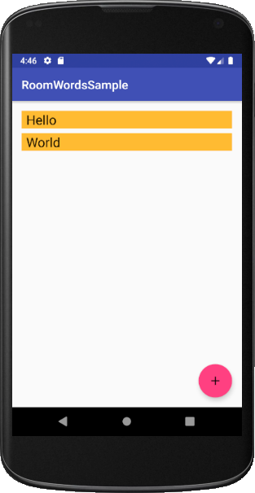

# Chat Disc
AndroidStudio - Chat  -  ROOM  - DocumentationGoogleJavaStyle

> The application to chat with anyone!

## Index

* [Objetives](#objetives)
* [Description/Instructions](#descriptioninstrutions)
* [Screenshots](#screenshots)
* [Features](#features)
* [Technologies](#technologies)
* [Sources](#sources)
* [Status](#status)
* [License](#license)
* [Contact](#contact)

## Objetives
Develop an application to chat with other people.

## Description/Instrutions
Create an application with which you can chat with another person one by one. 
The application must present comfortable contemporary features such as the 
format of the date of the messages, backup manipulation if there is no 
connection, login to authenticate and find other users, in addition to other 
features that make the use of chat comfortable.

## Screenshots

Principal interface

## Features
coming soon...

## Technologies
- JAVA 8 
- Gradle 
- Android Jetpack (Architecture Tecnologies) 
- ROOM for Android 
- Laravel 
- PHP Storm 
- multiple repositories to consume an API 

## Sources
- [Android ROOM](https://codelabs.developers.google.com/codelabs/android-room-with-a-view/#0)

## Status
- In development...

## License
Licenced by [MIT License](https://github.com/CharlieCondorcet/ChatDisc/blob/master/LICENSE)

## Contact
- Created by [@CharlieCondorcet](https://github.com/charliecondorcet)
- To report bugs and feedback: RandomNewsSupport@charliedroid.com
- Official website to manage new Android projects: www.charliedroid.com

