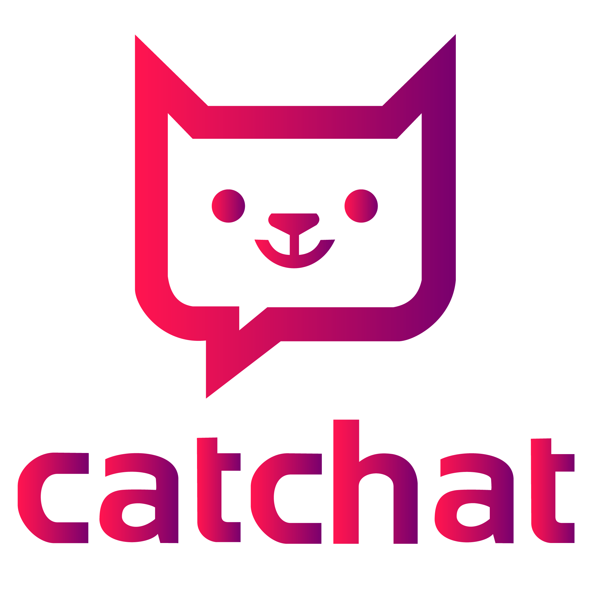
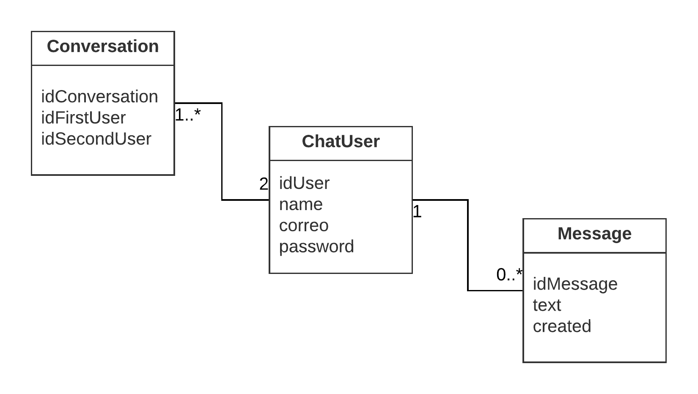
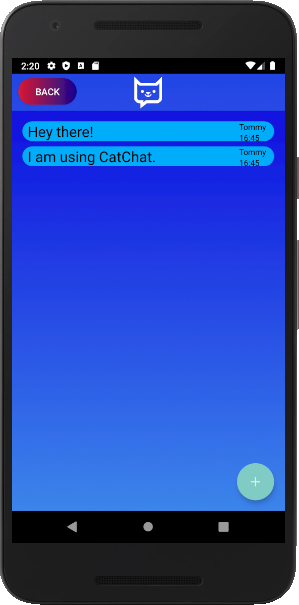
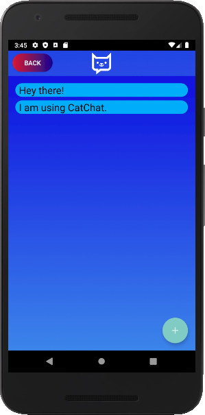
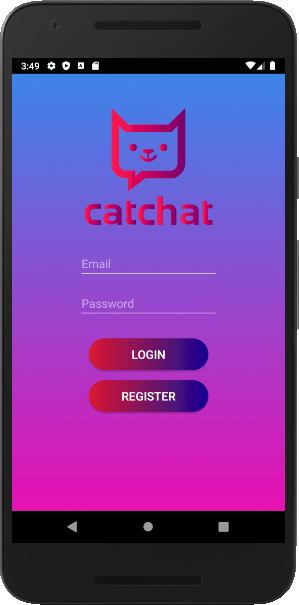
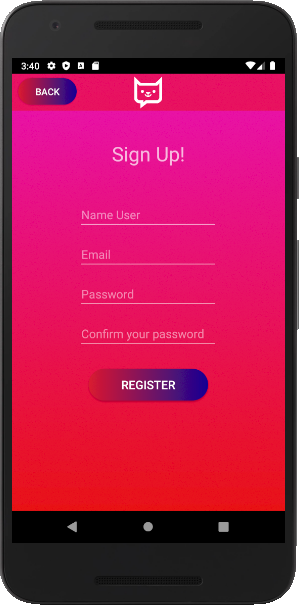

# <h1> CatChat (ChatDisc)</h1>

  

AndroidStudio - Chat  -  ROOM  - DocumentationGoogleJavaStyle  -  [Backend](https://github.com/CharlieCondorcet/ChatDiscBackend)

> The application to chat with anyone!

## Index

* [Objetives](#objetives)
* [Description/Instructions](#descriptioninstrutions)
* [DomainModel](#domainmodel)
* [Backend](#backend)
* [Screenshots](#screenshots)
* [Features](#features)
* [Technologies](#technologies)
* [Sources](#sources)
* [Status/ToDo](#status)
* [Issues](#issues)
* [License](#license)
* [Contact](#contact)

## Objetives
Develop an application to chat with other people.
Develop the backend to ChatDisc.

## Description/Instrutions
Create an application with which you can chat with another person one by one. 
The application must present comfortable contemporary features such as the 
format of the date of the messages, backup manipulation if there is no 
connection, login to authenticate and find other users, in addition to other 
features that make the use of chat comfortable.

# DomainModel

 <b>The Domain Model </b>
 
  
 
 The USER has 0 or many MESSAGES, each MESSAGE has a single user.
 A CONVERSATION has 2 USERS, a USER has 1 or more CONVERSATIONS.
 The idea is to relate the data such that whenever there is a user at least 
 have a conversation, with another user, this is so as not to have a blank 
 screen when you just start the session, but immediately request by ID to find 
 another user, a Once inside the conversation it is not mandatory to send 
 messages.
 Later, if you want to search for another user, you are given the option to 
 switch from Activity to another conversation.

## Backend
You can find the backend developed specifically for this application in
[ChatDiscBackend](https://github.com/CharlieCondorcet/ChatDiscBackend).

## Screenshots

 <b>The New Message</b>
 
  
 
 
 <b>The Conversation</b>
 
 
 
 
 <b>The Login</b>
 
 
 
 
 <b>The Register</b>
 
 

## Features
coming soon:
 - Landscape Mode
 - Nocture Mode.
 - Update The Toolbar.
 - Register With Other Account(Google, Facebook, Twitter).

## Technologies
For the complete Project, the following were used:
- JAVA 8 
- Gradle 
- Android Jetpack (Architecture Tecnologies) 
- ROOM for Android 
- Laravel 
- PHP Storm 
- multiple repositories to consume an API 

## Sources
- [Android ROOM](https://codelabs.developers.google.com/codelabs/android-room-with-a-view/#0)

## Status/ToDo
 The graphical interface of the application and the navigation through the 
 Activities is this achieved.
 The tests to do all the basic operations for each entity are approved.
 The logic of the chat is missing, to connect the user with their messages 
 and their conversation.
 the messages do not show the user or current time.
 the main chat room (MainActivity in this case) must be a conversation 
 which calls the other related entities.
 
 
 ## Issues
 Activity doesn't accept me a way to share DB lists with all current records.
 I can only instantiate the ViewModel in the MainActivity, if I try to 
 instantiate elsewhere the app does not open.
 The logcat warn a lot of task overload, that many processes are executed 
 in few threads.
 There are performance problems, if the PC was not with all other programs 
 closed, the app may take time to start and a "interface does not respond" 
 message appears.
 
 
## License
Licenced by [MIT License](https://github.com/CharlieCondorcet/ChatDisc/blob/master/LICENSE)

## Contact
- Created by [@CharlieCondorcet](https://github.com/charliecondorcet)
- To report bugs and feedback: CatChatSupport@charliedroid.com
- Official website to manage new Android projects: www.charliedroid.com

<h5 align="center"><i>Have a nice day! </i>:smile_cat::smile_cat::smile_cat:</h5>